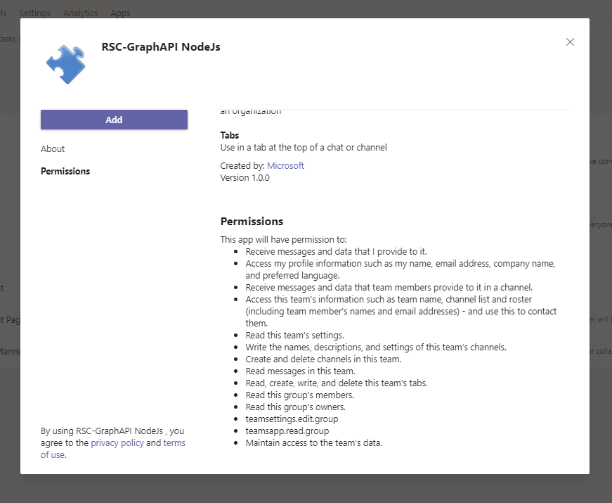
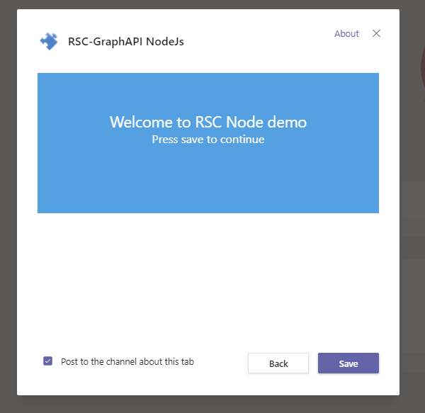
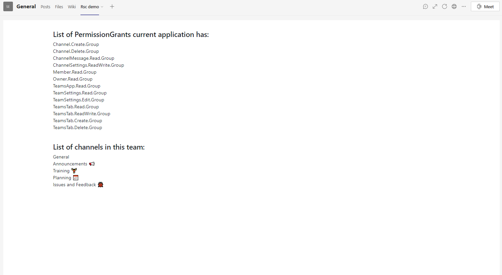

# RSC with Graph API using Node js

This sample illustrates you can use [Resource Specific Consent](https://docs.microsoft.com/en-us/microsoftteams/platform/graph-api/rsc/resource-specific-consent) to call Graph API.


## Prerequisites

- [NodeJS](https://nodejs.org/en/)
- [ngrok](https://ngrok.com/) or equivalent tunnelling solution

## To understand this code

* [auth.js] is where the token is retrieved
* [server.js] is the intially called file after npm start. `app.get(<function name>)` seems to be run every time `${window.location.origin}/<function name>` is called 
* [views > index.ejs] is where the tabs are set up (the pop up right before the app is added to teams and where you had to press save)
* [views > justbutton.ejs] is where the button is created and handles deleting the teams channel
* [teamsManifest folder] is the skeleton needed to publish the app

## To try this sample

1) Clone the repository

    ```bash
    git clone https://github.com/OfficeDev/Microsoft-Teams-Samples.git
    ```

1) In a terminal, navigate to `samples/graph-rsc/nodejs`

1) Install modules

    ```bash
    npm install
    ```

1) Run ngrok - point to port 3978

    ```bash
    ngrok http -host-header=rewrite 3978
    ```


1) Update the `.env` configuration for the bot to use the Microsoft App Id and App Password from the Bot Framework registration. (Note the App Password is referred to as the "client secret" in the azure portal and you can always create a new client secret anytime.)

3) Insert a pre-existing teams channel id under this tenant into the url under `justbutton.ejs` (this can be retrieved via [Graph Explorer](https://docs.microsoft.com/en-us/graph/api/channel-get?view=graph-rest-1.0&tabs=http)) that needs to be deleted

1) Run your bot at the command line:

    ```bash
    npm start
    ```

1) __*This step is specific to Teams.*__
    - **Edit** the `manifest.json` contained in the  `teamsAppManifest` folder to replace your Microsoft App Id (that was created when you registered your bot earlier) *everywhere* you see the place holder string `<<YOUR-MICROSOFT-APP-ID>>` (depending on the scenario the Microsoft App Id may occur multiple times in the `manifest.json`)
    - **Edit** the manifest `configurationUrl` under configurable tabs such that it is the same \*.ngrok.io as what was displayed in the 4th step but with https
    - **Zip** up the contents of the `teamsAppManifest` folder to create a `manifest.zip` to your local computer
    - **Upload** the `manifest.zip` to Teams (in the Apps view click "Upload a custom app") 
    - **Still confused? [For the Garage GE team]** visit the Garage one note (`Project Structure > create a teams app`) and skip to `Update your app's manifest with the API schema`.  

   


   


   


